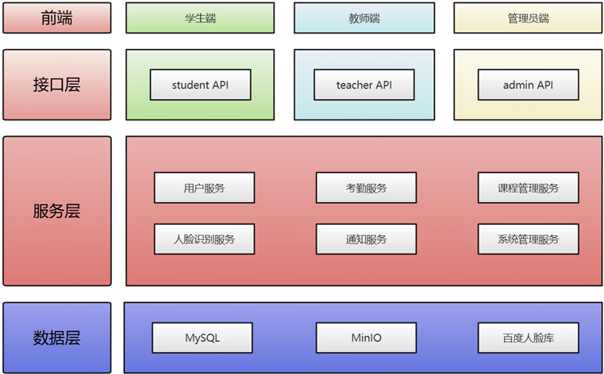
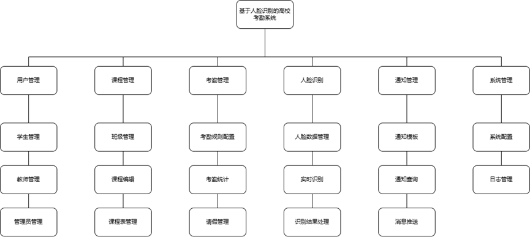

# 技术架构文档

## 1. 系统架构

### 1.1 整体架构


### 1.2 技术栈
- 前端技术栈：
  - Vue.js 3.0
  - Element Plus
  - Axios
  - Vue Router

- 后端技术栈：
  - Spring Boot 3.2.4
  - Spring Cloud 2023.0.1
  - Spring Cloud Alibaba 2023.0.1.0
  - MyBatis-Plus 3.5.5
  - MySQL 8.0.33
  - Redis
  - JWT
  - Logback
  - Minio

## 2. 人脸识别服务架构

### 2.1 服务架构


### 2.2 核心组件
1. 人脸识别控制器（FaceRecognitionController）
   - 处理人脸相关的HTTP请求
   - 参数验证和转换
   - 响应结果封装

2. 人脸识别服务（FaceRecognitionService）
   - 人脸检测
   - 人脸注册
   - 人脸搜索
   - 人脸更新
   - 人脸删除

3. 数据访问层（Mapper）
   - FaceDataMapper：人脸数据访问
   - RecognitionLogMapper：识别日志访问

4. 配置管理
   - BaiduFaceProperties：百度人脸识别配置
   - MyBatis-Plus配置
   - 数据库配置

## 3. 考勤服务架构

### 3.1 服务架构
```
+------------------+     +------------------+     +------------------+
|                  |     |                  |     |                  |
|  考勤服务        |     |  人脸识别服务     |     |  数据存储服务    |
|  (Attendance)    |     |  (Recognition)   |     |  (MySQL)        |
|                  |     |                  |     |                  |
+------------------+     +------------------+     +------------------+
```

### 3.2 核心组件
1. 考勤控制器（AttendanceController）
   - 处理考勤相关的HTTP请求
   - 参数验证和转换
   - 响应结果封装

2. 考勤服务（AttendanceService）
   - 考勤计划管理
   - 签到管理
   - 考勤记录管理
   - 考勤统计

3. 数据访问层（Mapper）
   - AttendanceScheduleMapper：考勤计划访问
   - AttendanceRecordMapper：考勤记录访问

4. 配置管理
   - 数据库配置
   - Redis配置
   - 服务配置

## 4. 数据流转

### 4.1 人脸识别流程
1. 前端采集人脸图片
2. 图片Base64编码
3. 调用人脸识别服务
4. 服务调用百度API
5. 处理识别结果
6. 保存识别记录
7. 返回处理结果

### 4.2 考勤流程
1. 教师发起考勤
2. 创建考勤计划
3. 学生进行签到
4. 调用人脸识别
5. 验证身份
6. 记录考勤
7. 统计结果

## 5. 安全架构

### 5.1 认证授权
- JWT token认证
- 角色权限控制
- 接口访问控制

### 5.2 数据安全
- 数据加密传输
- 敏感信息脱敏
- 数据备份恢复

### 5.3 系统安全
- 防SQL注入
- XSS防护
- CSRF防护
- 请求限流
- 日志审计